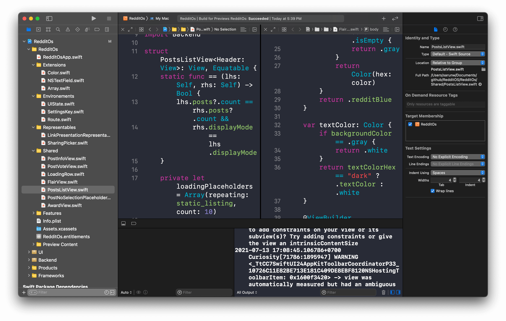

# XCode, o VSCode da Apple

  
  <legend>
    O primo rico do Vscode
  </legend>

Para quem usa Mac para desenvolver, já deve ter se deparado com o XCode, e percebido que ele é exatamente igual ao VSCode.

  

Ele tem suas particularidades, porém é essencialmente o mesmo editor, com o único empecilho de que o XCode só roda em sistemas operacionais MacOs.
Para quem necessita desenvolver para iOS, feliz ou infelizmente você terá que adquirir um Mac, pois você só consegue criar o bundle do seu Apk para iOs em uma máquina que contenha MacOs. Existem alguns serviços online para ajudar com isso, servidores de aluguel, mas você não vai fugir do Mac. **hahahaha**

## Conclusão

Se você usa VSCode e vai migrar para o XCode, não vai sentir nenhuma diferença.
O layout é praticamente o mesmo, as extensões estão lá, as configurações são parecidas. Por esse motivo, eu dei 5 estrelas de 5 para esse editor. 