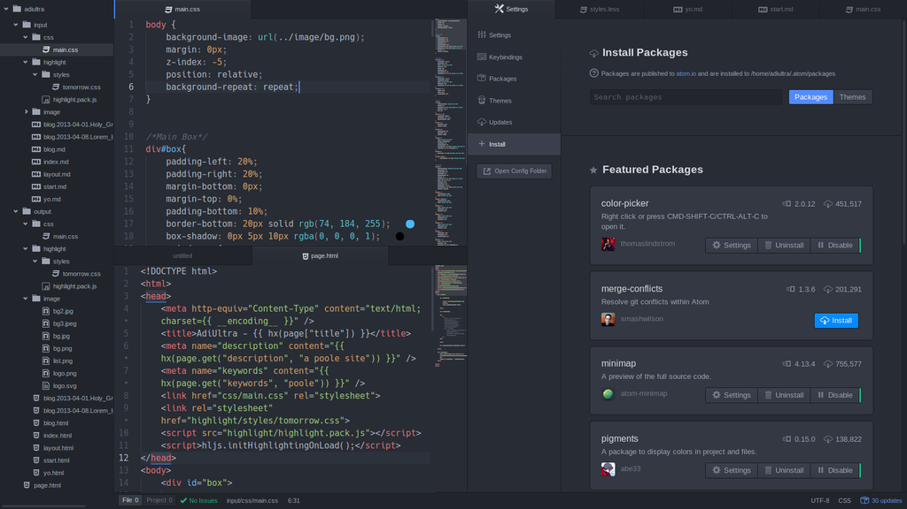

# Atom, o VSCode do Github

  
  <legend>
    O tio do Vscode
  </legend>

Se você está nessa a um pouco mais de tempo, ja ouviu ou viu alguém utilizando o **Atom**.
Desenvolvido pela empresa Github em 2014, o Atom veio para melhorar o ambiente do desenvolvedor, com auto complete, os primeiros temas e extensões.
O Atom veio para revolucionar, sendo melhor, mais leve, mais customizável que seu antecessor **Sublime Text**, além de gratuito, o que geralmente é o que pesa na balança.

  

## Conclusão

Hoje em dia, o atom já foi deixado de lado, porque o VSCode tem extensões até para sanduicheiras elétricas, mas voce irá conseguir desempenhar muito bem a sua função.