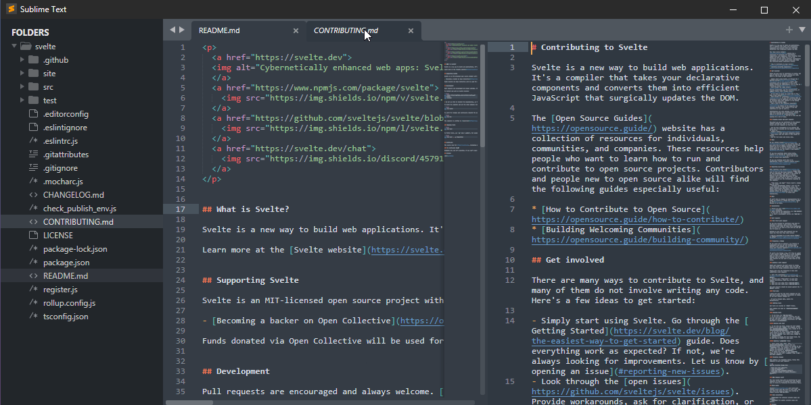

# SublimeText, o pai de todos

  
  <legend>
    O pai de todos os editores modernos
  </legend>

Vindo desde 2008, o Sublime ainda é utilizado por muitos devs, sejam por serem da "velha guarda" (velha guarda de 2008 kkkkk) ou seja pela sua interface super minimalista ou até mesmo porque já pagou agora vai usar até o final, porque **99 doletas** não dão em árvore né.
Mas desde aquela época, os editores vem sendo mais ou menos a mesma coisa, diferindo apenas na quantidades de extensões e popularidade ou a quantidade de memória que eles necessitam para se manter rodando.

  

## Conclusão

Já comprou? Usa. Não comprou ainda e quer um editor para programar? Vai de VSCode.
Não tem nada de errado com o Sublime, muitas pessoas gostam e até preferem, mas nao tem nada de mais que os outros. 